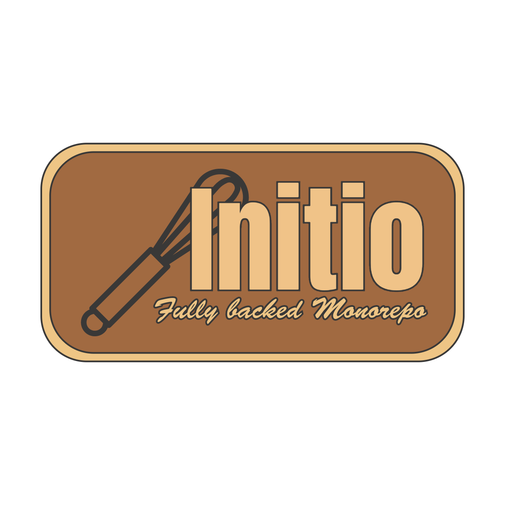

<h1 align="center">
  
  
</h1>


<h4 align="center">A starter for a Next.js & Expo monorepo with shared UI components and logic, preconfigured tRPC and authentication, Drizzle & Solito.</h4>

<p align="center">
  <a href="#technology-stack">Key Features</a> •
  <a href="#-repo-structure">Structure</a> •
  <a href="#-start-the-app">Start the app</a> •
  <a href="#-deployment-of-nextjs-app">Deployment</a> •
  <a href="#-database-migrations">Migrations</a> •
<a href="LICENSE.md">MIT licensed</a>
</p>


Many thanks to [@FernandoTheRojo](https://twitter.com/fernandotherojo) for Solito and the Solito starter monorepo which this was forked from.

## Technology stack
The repo is baked with
- Expo SDK 51 & Next.js with App Router
- tRPC endpoints and tRCP client components for Next.js and Expo
- authentication with NextAuth for web, and an OAuth server with Expo AuthSession for Expo
  - automatic token refresh and request repetition
  - token validation on tRPC endpoints
- Drizzle as ORM
- NativeWind & TailwindCSS for styling
- Solito for unified navigation
- Docker Compose setup for development & production builds

## 🏁 Start the app
To start the web and native app during development with instant refresh support, follow the steps below: 

- Install dependencies (only once): `yarn`
- Start Next.js: `docker compose up` (creates a mysql database container and runs `yarn web`)
- Start Expo:
  - First, build a dev client onto your device or simulator (only once)
    - `cd apps/expo`
    - Then, either `expo run:ios`, or `eas build`
  - After building the dev client, from the root of the monorepo...
    - `yarn native`
    - Ensure Next.js runs (see above)

## 📁 Repo structure

Yarn workspaces separate the code for the Expo & Next.js app and shared packages.

- `apps` Expo & Next.js apps

  - `expo`
  - `next`

- `packages` shared workspaces across apps
  - `app` shared logic and ui for both Expo and Next.js
    - `features` define ui screens (feature centric) by using components from `design`
    - `provider` providers that wrap both Expo and Next.js apps
    - `design` shared components. Define new components as you need
      - `typography` components regarding text
      - `layout` components regarding layout
  - `db` database configuration
    - `schema`table definitions

## 🔁 Database migrations
Changes to the database scheme must be committed by running
```sh
yarn migrations:generate
```
This command generates migration files. The migrations are applied automatically by restarting the container.


## 💾 Environment variables
### Expo
The environment variables inside /apps/expo/.env and /apps/expo/.env.production must be adopted to point to a running Next.js app


## 🆕 Adding dependencies

### JS dependencies, suitable for Next and Expo

Install packages shared on all platforms in `packages/app`:

```sh
cd packages/app
yarn add date-fns
cd ../..
yarn
```

### Native dependencies

If you're installing a library with any native code, you must install it in `apps/expo`:

```sh
cd apps/expo
yarn add react-native-reanimated

cd ../..
yarn
```


## 🚀 Deployment of Next.js app
Use the docker-compose.prod file to run the web app together with a MySQL database in your production environment. You may need to adjust the env variables in the docker-compose.prod file.


## Debugging
- Authentication in the Expo app throws an error like "Invalid redirect uri": Add the current Expo url (e.g. exp://192.168.178.117:8081) to `redirectUris` in `apps/next/server/lib/typescript-node-oauth-server/repositories.ts`

